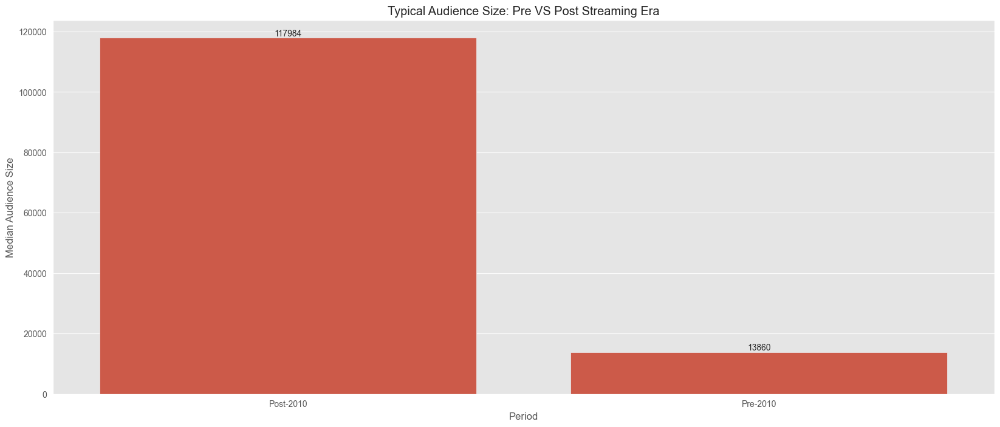
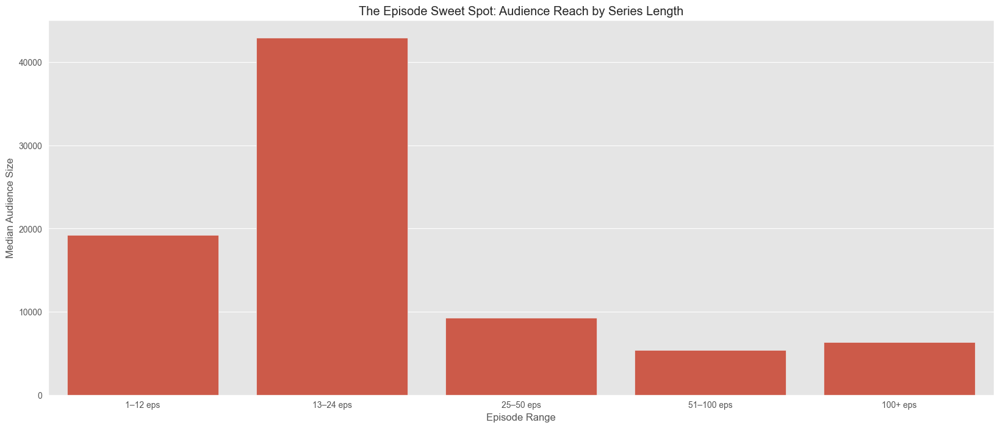
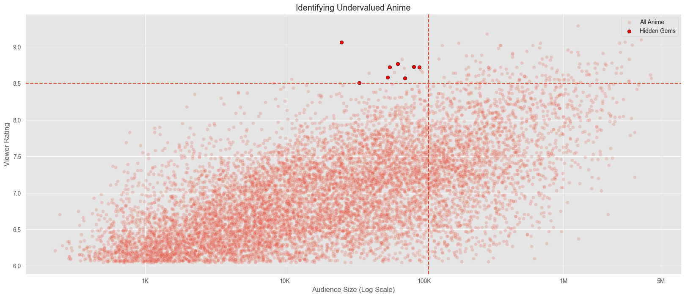

<p align="center">
  
  
  
  
</p>

---

# Anime Streaming Content Strategy  
### A Data-Driven Audience Analysis for Licensing & Platform Growth

---

## 📌 Executive Summary

This project analyzes long-term audience behavior in the anime industry to identify the factors that drive successful streaming content.

Using a dataset of **10,000 anime titles**, the analysis evaluates how release timing, episode structure, and viewer ratings influence audience scale — translating raw data into actionable licensing strategy insights.

The goal is to simulate the type of analysis a streaming platform might conduct when deciding:

- Which titles to acquire  
- What format performs best  
- Whether high ratings reliably translate into audience reach  
- Where hidden growth opportunities exist  

---

## ❓ Strategic Questions Answered

- Is anime demand structurally growing or driven by short-term hype?
- What series length attracts the largest audiences?
- Do elite-rated titles consistently outperform?
- How has the streaming era reshaped viewer behavior?
- Where can platforms identify undervalued content early?

---

## 🛠 Tools & Technologies

- **Python**
- **Pandas & NumPy** — data cleaning and transformation  
- **Matplotlib & Seaborn** — exploratory and strategic visualization  
- **Jupyter Notebook** — analytical workflow  

---

## 📂 Project Structure

```
anime-streaming-content-strategy/
│
├── notebook/
│ └── anime-streaming-content-strategy.ipynb
│
├── report/
│ └── anime-streaming-content-strategy.html
│
├── images/
│
└── README.md
```

---

## 📊 Core Analyses

### 📈 Market Expansion: Pre vs Post Streaming Era
Anime audiences have expanded dramatically in the post-2010 period, signaling a structural shift from niche consumption toward global mainstream adoption.


---

### 🎯 Format Sweet Spot: Episode Count vs Audience Reach
Series in the **13–24 episode range** achieve the strongest typical audience size, suggesting alignment with modern binge-friendly viewing habits.


---

### ⭐ Quality vs Reach
Elite-rated titles attract substantially larger audiences on average, confirming that viewer satisfaction strongly supports discoverability and word-of-mouth growth.
However, select mid-rated titles still achieve scale — highlighting the influence of franchise power and marketing.


---

### 🔍 Hidden Gems
A small cluster of highly rated yet underexposed titles reveals opportunities for early licensing before broader market discovery.



---

### 📊 Audience Growth Over Time
Longitudinal trends show sustained audience expansion, reinforcing that anime demand reflects durable market growth rather than temporary spikes.


---

## 🚀 Key Strategic Takeaways

- Prioritize modern releases to capture expanding global demand  
- Target mid-length series when possible — they consistently deliver strong reach  
- Treat ratings as a powerful risk-reduction signal  
- Identify high-quality titles early to secure licensing value  
- Avoid overcommitting to extremely long series without proven franchise strength  

---

## 📎 How to Explore the Project

### 👉 Option 1 — View the Executive Report (Recommended)
Open the HTML file inside the `report` folder for a clean, presentation-style version of the analysis.

---

### 👉 Option 2 — Review the Technical Notebook
Explore the full Python workflow inside `notebook` to see the data preparation, feature engineering, and visualization process.

---

## 💡 Why This Project Matters

Streaming platforms increasingly rely on data to guide billion-dollar content decisions.

This project demonstrates the ability to:

- Translate raw datasets into strategic insight  
- Connect viewer behavior to business outcomes  
- Communicate findings in an executive-ready format  

---

## 📬 Contact

**Author:** Shohag  

- 💼 LinkedIn: [NURA ALAMA SHOHAG](https://www.linkedin.com/in/dataanalystshohag/)  
- 🧑‍💻 GitHub: [Shohag-DataAnalyst](https://github.com/Shohag-DataAnalyst)
